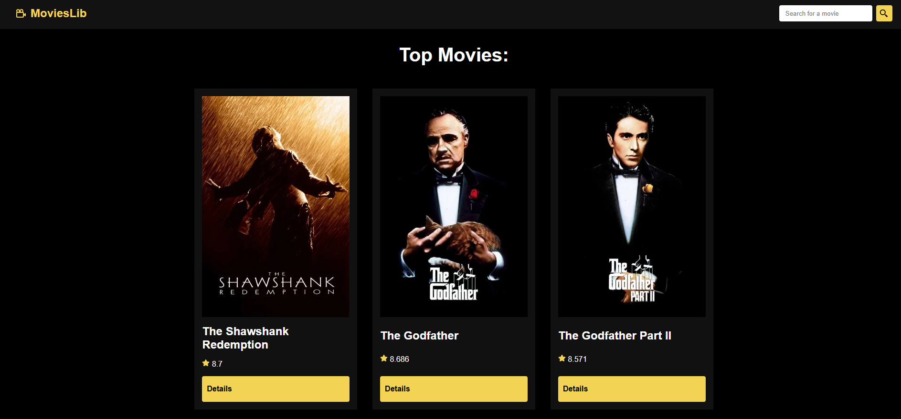

# Movie App

**Movie App** is a simple React-based web application that allows users to browse top-rated movies using the TMDB (The Movie Database) API. This app shows a list of top-rated movies, including their titles, posters, and average ratings. Users can also click on a movie to see more detailed information.

This project was built using **React** and **TMDB API**.

## 🖥️ Live Demo

You can check out the live version of the app here:

[Movie App - Live Demo](https://movies-lib-gules.vercel.app/)

## 🎬 Features

- Browse top-rated movies
- See movie details like budget, revenue, runtime, and description
- Responsive layout for mobile and desktop devices
- User-friendly interface with clear visuals

## 📸 Screenshot



## 🚀 Setup

### 1. Clone the repository:

```bash
git clone https://github.com/amandobarbosa/movies_lib.git
cd movies_lib


